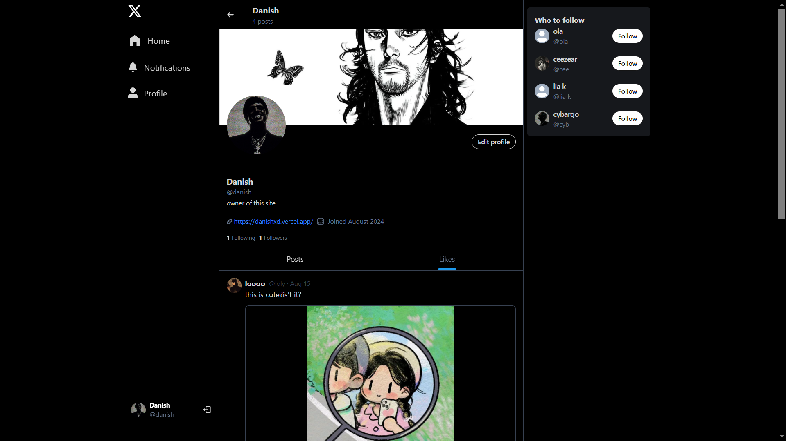
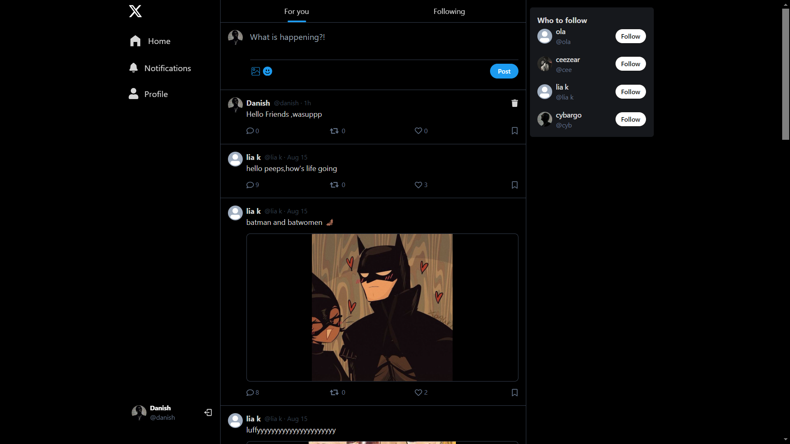

# X 

A social media platform built with MERN (MongoDB, Express.js, React.js, Node.js) and Tailwind CSS. Users can create posts, interact with others, and customize their profiles.

## Screenshots

## Features

- ⚛️ Tech Stack: React.js, MongoDB, Node.js, Express, Tailwind
- 🔐 Authentication with JSONWEBTOKENS (JWT)
- 🔥 React Query for Data Fetching, Caching etc.
- 👥 Suggested Users to Follow
- ✍️ Creating Posts
- 🗑️ Deleting Posts
- 💬 Commenting on Posts
- ❤️ Liking Posts
- 🔒 Delete Posts (if you are the owner)
- 📝 Edit Profile Info
- 🖼️ Edit Cover Image and Profile Image
- 📷 Image Uploads using Cloudinary
- 🔔 Send Notifications
- ⏳ And much more!

# Tech Stack

**React.js**: A popular JavaScript library for building user interfaces, providing a component-based architecture for efficient development.

**MongoDB**: A flexible NoSQL database that excels at handling unstructured data, making it well-suited for social media applications.

**Node.js**: A JavaScript runtime environment for server-side applications, enabling efficient communication between the client and server.

**Express.js**: A lightweight and unopinionated web framework for Node.js, providing a robust foundation for building API endpoints.

**Tailwind CSS**: A utility-first CSS framework that offers a wide range of pre-built classes for rapid styling, streamlining the development process.
Authentication**:

**JSON Web Tokens (JWT)**: A secure and stateless way to authenticate users, ensuring the integrity and authenticity of data.

# **Data Management**:

**React Query**: A powerful data management library that simplifies data fetching, caching, and updating, improving application performance and user experience.

 # **User Interaction**:

**Suggested Users**: Provides recommendations based on user interests or connections, fostering community engagement.

**Post Creation, Deletion, and Editing**: Enables users to share content, manage their posts, and keep their profiles up-to-date.

**Commenting, Liking, and Notifications**: Facilitates user interactions and keeps users informed about relevant activities.
Media Integration**:

**Image Uploads**: Allows users to upload profile images and cover photos using Cloudinary, a popular cloud-based image and video management service.
Enhancements**:

**Mobile Optimization**: Ensure your application is fully responsive and provides a seamless experience on mobile devices.
Accessibility: Prioritize accessibility to make your platform usable by people with disabilities.

**Security**: Implement strong security measures to protect user data and prevent unauthorized access.
## Environment Variables

To run this project, you will need to add the following environment variables to your .env file

`MONGO_URL`

`PORT`

`SECRET_JWT`

`NODE_ENV = "development"`

`CLOUDINARY_CLOUD_NAME`

`CLOUDINARY_API_KEY`

`CLOUDINARY_SECRET_API_KEY`